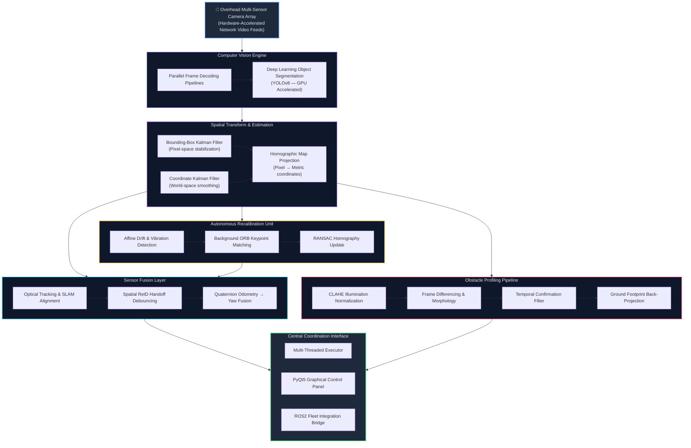

<div align="center">
    
### 🤖Multicamera Perception

### Real-Time Multi-Camera ROBOT Tracking & Fleet Management System

[](https://www.python.org/)
[](https://docs.ros.org/)
[](https://pytorch.org/)
[](https://opencv.org/)
[](https://opensource.org/licenses/MIT)
(https://github.com/rpvishaanth/Multicamera_Perception/stargazers)

*A warehouse-scale, centimeter-accurate robot tracking platform powered by multi-sensor fusion and real-time computer vision.*

[📖 Documentation](#-system-architecture) · [🚀 Getting Started](#-tech-stack--requirements) · [🗂️ Structure](#️-repository-structure) · [🔌 Integration](#-system-integration)

</div>

---

## 📌 Project Overview

This system provides a **centralized control room architecture** capable of tracking a heterogeneous fleet of Autonomous Mobile Robots (AMRs) in real-time across wide-area warehouse environments using arrays of overhead camera streams.

By fusing high-speed optical detections with physical robot odometry, the platform delivers a **unified, centimeter-accurate coordinate visualization space**. The software dynamically handles camera handoffs, flags untracked static/dynamic obstacles, auto-recalibrates visual coordinate transforms on the fly, and broadcasts spatial state corrections back into the robot operating ecosystem.

<div align="center">

<br/>
<sub><i>Main PyQt5 Control Dashboard — Multi-camera grid, real-time tracking overlays, and fleet log panel</i></sub>
</div>

---

## 🚀 Key Engineering Capabilities

| Capability | Description |
|---|---|
| **Scalable Vision Orchestration** | Manages hardware-accelerated multi-stream decoding over local network sockets with zero-copy frame management |
| **Stateful Object Detection** | Fine-tuned deep learning detector coupled with statistical estimators to eliminate high-frequency spatial noise |
| **Dynamic Spatial Calibration** | Continuous background feature-tracking pipelines that update homography matrices during physical sensor displacement |
| **Multi-Modal State Fusion** | Fuses optical tracking with onboard robot odometry (SLAM) using spatial Re-ID to bridge estimation gaps |
| **Obstacle Reconstruction** | Background subtraction and homographic back-projection to identify and publish static or dynamic obstacles |

---

## 📐 System Architecture



---

## 🛠️ Core Modules — Technical Breakdown

### 🎥 Optical Pipeline & Deep Learning Engine

The video ingestion layer decouples high-frequency frame capture from the main application thread using dedicated system queues, preventing pipeline stalls under peak load.

- **Decoding Pipeline** — Processes multiple simultaneous HD streams with hardware-accelerated decoders via GStreamer and LibAV bindings.
- **Target Recognition** — Fine-tuned YOLOv8 model with GPU-accelerated inference for real-time AMR detection and segmentation.
- **Context Preservation** — Dynamically pauses/resumes camera thread contexts based on regional fleet occupancy to reduce CPU/GPU overhead.

---

### 📍 Live Fleet Map Visualization

<div align="center">

<br/>
<sub><i>2D Fleet Map — Live AMR trails, active heading vectors, and point-cloud reconstructed obstacle footprints</i></sub>
</div>

---

### 📊 Multi-Stage Estimation & Spatial Filtering

To handle camera vibration, occlusion, and noise, a decoupled dual-stage Kalman architecture is used:

**Stage 1 — Bounding-Box Stabilization (Pixel Space)**

Prevents bounding-box jitter using a state-space Kalman Filter:

$$\vec{x}_{bbox} = \begin{bmatrix} c_x & c_y & w & h & v_{cx} & v_{cy} \end{bmatrix}^T, \quad \vec{z}_{bbox} = \begin{bmatrix} c_x & c_y & w & h \end{bmatrix}^T$$

**Stage 2 — Coordinate Smoothing (World Space)**

A secondary Kalman Filter neutralizes transition jumps during cross-camera agent handoffs:

$$\vec{x}_{pose} = \begin{bmatrix} r_x & r_y & v_x & v_y \end{bmatrix}^T$$

---

### 🗺️ Coordinate Transforms & Homography Mapping

Each camera stream is mapped to global warehouse coordinates via a custom homographic projection. Pixel coordinates $(u, v)$ are projected into map space $(x_m, y_m)$:

$$\begin{bmatrix} x_m' \\ y_m' \\ w \end{bmatrix} = H \begin{bmatrix} u \\ v \\ 1 \end{bmatrix}, \quad \text{where} \quad x_m = \frac{x_m'}{w},\; y_m = \frac{y_m'}{w}$$

Physical coordinates are then translated into metric space using scaled transformation matrices derived from environment point-cloud (PCD) files.

---

### 🧭 Orientation & Heading Fusion

Absolute robot heading is computed by fusing three independent spatial cues via a weighted circular mean filter:

1. **Optical Heading Inference** — Extracts physical robot geometry from rotated polygon bounding hulls.
2. **Kinematic Trajectory Vectors** — Infers movement orientation via Principal Component Analysis (PCA) on historical position matrices.
3. **Robot Odometry Feedback** — High-frequency telemetry quaternions are converted and combined with optical streams for a noise-tolerant yaw estimate.

---

### 🔧 Automated Calibration & Drift Adaptation

Cameras mounted on warehouse structures are susceptible to structural vibration and physical shift over time.

- **Drift Detection** — Affine partial matrix comparison tracks reference keyframes. Recalibration triggers when rotation or displacement exceeds configurable thresholds.
- **Background Realignment** — An asynchronous worker thread runs ORB keypoint-matching and RANSAC to compute a corrective homography:

$$H_{\text{movement}} = \text{RANSAC}\left(\text{BFMatcher}\left(\text{ORB}_{\text{ref}},\; \text{ORB}_{\text{current}}\right)\right)$$

Homography matrices are updated thread-safely without interrupting active tracking tasks.

---

### 🚧 Optical Obstacle Profiling

An independent frame-differencing pipeline detects unmapped obstacles such as human operators or dropped cargo:

1. Applies **CLAHE** to counter illumination fluctuations.
2. Evaluates absolute pixel discrepancy: $\mathbf{I}_{\text{diff}} = | \mathbf{I}_{\text{ref}} - \mathbf{I}_{\text{current}} |$
3. Filters noise with morphological operations ($7 \times 7$ Open, $15 \times 15$ Close).
4. Masks out expected vehicle footprints to isolate environmental anomalies.
5. Applies a **temporal confirmation filter** across consecutive frames before back-projecting the obstacle's ground footprint into the fleet coordination map.

---

## 🗂️ Repository Structure

```
Multicamera_Perception/
│
├── config/                  # Core parameters, tracking boundaries & thresholds
│
├── modules/
│   ├── gui/                 # PyQt5 dashboard & 2D point-cloud overlay renderer
│   ├── pipeline/            # Video streaming pipelines & camera lifecycle managers
│   ├── tracking/            # Detection, state-estimation & sensor fusion logic
│   └── bridge/              # Inter-process middleware & ROS2 interface nodes
│
└── utils/                   # Geometry helpers, calibration tools & map loaders
```

---

## 🔌 System Integration

The platform operates as an **external supervisor** bridging visual inputs with standard robotics middleware. It integrates cleanly with ROS2 Humble and Iron distributions:

- **Inputs** — Subscribes to dynamic coordinate transforms and onboard state estimates from standard robotics drivers.
- **Outputs** — Publishes back-projected metric coordinate adjustments and environmental occupancy arrays to update navigation nodes.
- **Thread Safety** — Asynchronous signal-and-slot bridges guarantee isolation between system executors and the user-facing dashboard.

```
ROS2 Topics (Inputs)                  ROS2 Topics (Outputs)
─────────────────────                 ──────────────────────────
/tf, /odom                  ──►  ──►  /amr/tracked_poses
/robot/state                ──►  ──►  /map/obstacle_footprints
/camera/*/image_raw         ──►  ──►  /amr/heading_estimates
```

---

## 💻 Tech Stack & Requirements

| Layer | Technology |
|---|---|
| **Language** | Python 3.10+ |
| **Robotics Framework** | ROS2 Humble / Iron |
| **Computer Vision** | OpenCV 4.x, NumPy |
| **Deep Learning** | PyTorch, Ultralytics YOLOv8 |
| **Video Decoding** | GStreamer, LibAV (hardware-accelerated) |
| **UI & Rendering** | PyQt5 (OpenGL / QPainter pipeline) |
| **System Bindings** | PyGObject (GStreamer bindings) |

---

## ⚖️ License

This project is licensed under the **MIT License** — see the [`LICENSE`](./LICENSE) file for full terms.

```
MIT License

Copyright (c) 2024 rpvishaanth

Permission is hereby granted, free of charge, to any person obtaining a copy
of this software and associated documentation files (the "Software"), to deal
in the Software without restriction, including without limitation the rights
to use, copy, modify, merge, publish, distribute, sublicense, and/or sell
copies of the Software, and to permit persons to whom the Software is
furnished to do so, subject to the following conditions:

The above copyright notice and this permission notice shall be included in all
copies or substantial portions of the Software.

THE SOFTWARE IS PROVIDED "AS IS", WITHOUT WARRANTY OF ANY KIND, EXPRESS OR
IMPLIED, INCLUDING BUT NOT LIMITED TO THE WARRANTIES OF MERCHANTABILITY,
FITNESS FOR A PARTICULAR PURPOSE AND NONINFRINGEMENT. IN NO EVENT SHALL THE
AUTHORS OR COPYRIGHT HOLDERS BE LIABLE FOR ANY CLAIM, DAMAGES OR OTHER
LIABILITY, WHETHER IN AN ACTION OF CONTRACT, TORT OR OTHERWISE, ARISING FROM,
OUT OF OR IN CONNECTION WITH THE SOFTWARE OR THE USE OR OTHER DEALINGS IN THE
SOFTWARE.
```

---

<div align="center">
  <sub>Built with 🔬 precision by <a href="https://github.com/rpvishaanth">rpvishaanth</a></sub>
</div>
